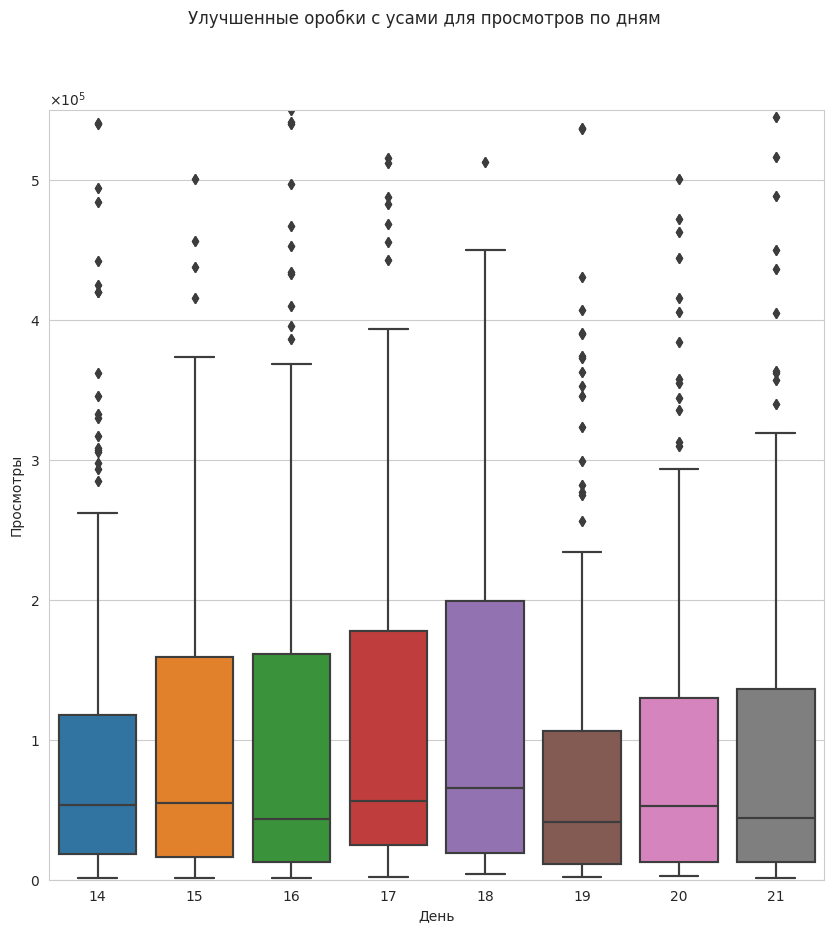
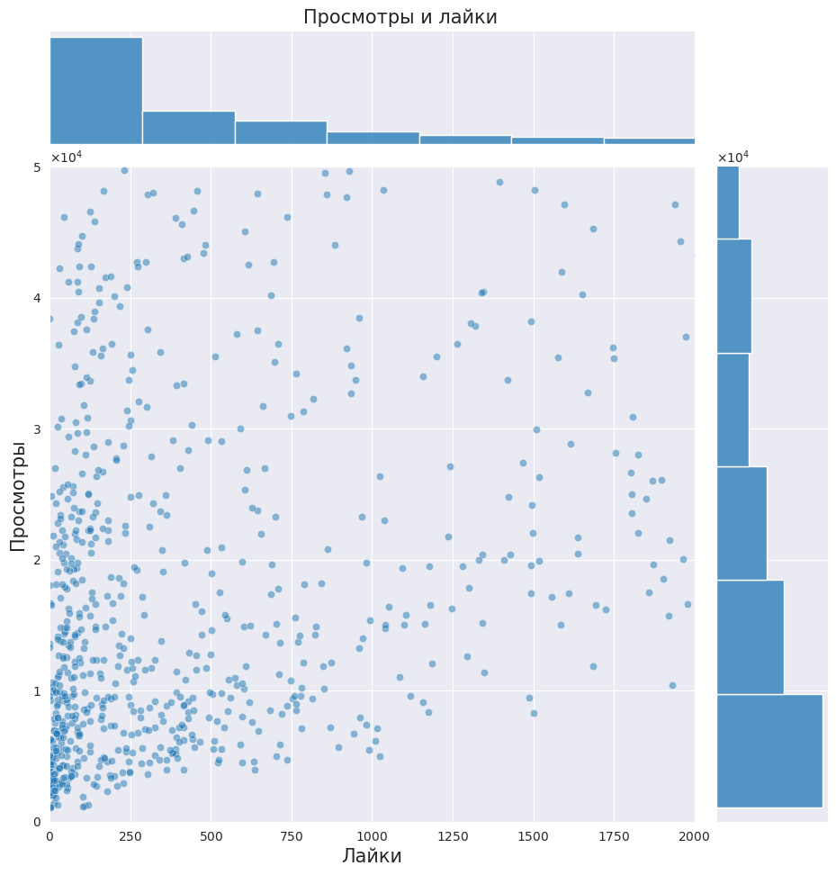
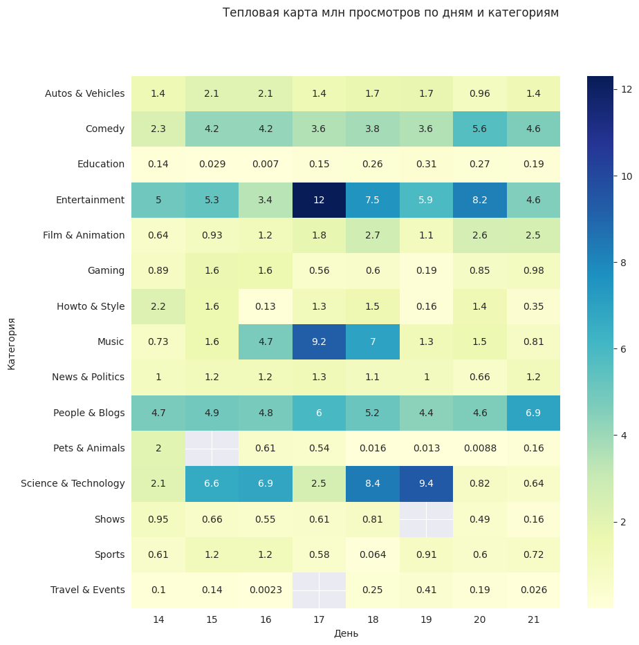
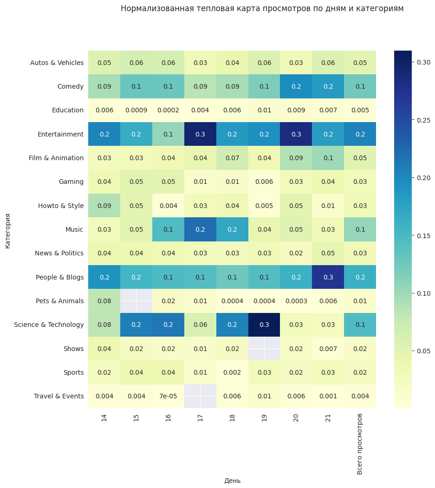

# Анализ некоторых данных с YouTube

###  Второе домашнее задание по курсу "Введение в анализ данных"

#### Якушев Георгий Б05-111

## Введение и задачи

В данной работе были исследованны данные с платформы YouTube
за определенный промежуток времени. Несмотря на очень спицифичные данные,
удалось установить некоторые качественные зависимости количества просмотров
в зависимости от некоторых параметров. 
## Исходные данные

Исходными данными были данные о видео в российском сегменте
YouTube с 14 ноября по 21 ноября 2017 года. Полная версия данных лежит
на [*Kaggle*](https://www.kaggle.com/datasets/datasnaek/youtube-ne 1 ew).

## Методология

Для анализа этих данных использовались базовые методы визуализации данных. 
Для обработки и исследования были использованы инструменты библиотек *python*: 
*matplotlib*, *pandas*, *seaborn*, *numpy* и др.

### Количества просмотров по дням
Для начала были изучены дни недели для предоставленных данных.

| Дата | 2017-11-14 | 2017-11-14 | 2017-11-14 | 2017-11-14 | 2017-11-14 | 2017-11-14  | 2017-11-14  | 2017-11-14 |
|:---:| :---:|:----------:|:----------:|:----------:|:----------:|:-----------:|:-----------:| :---:| 
| День недели | Вторник |   Среда    |  Четверг   |  Пятница   |  Суббота   | Воскресенье | Понедельник | Вторник | 

Сгрупировав данные о просмотрах по дням, былы построены
коробки с усами на каждый из этих дней (график ниже).

| Коробки с усами для просмотров по дням в ноябре 2017 |
|:-------------------------------------------:|
|           |

По графику видно, что на протяжении этих восьми дней количество
просмотров возрастало. 12 ноября 2017 года - вторник, а значит на 18 число
приходится суббота. Локальный пик по просмотрам приходится на субботу, а 
локальный минимум на в оскресенье (18 и 19 числа ноября соответственно). 
Также по отношению медианы и бокса можно понять, что видео распределены 
неравномерно по просмотрам.

### Зависимость лайков и просмотров

Для исследования этой зависимости был постоен присоединенный график
лайков и просмотров (график ниже).

| График зависимости просмотров и лайков |
|:-------------------------------------------:|
|           |

Исходя из полученых данных можно сказать, что количество видео от 
количества лайков или просмотров падает экспоненциально, о чем свидетельствуют
гистограммы по бокам. При этом большинство видео сгруппировано возле области с
малым числом лайков и возможно большим количесвтом просмотров.

### Распеределения просмотров по категориям

| Тепловая карта млн просмотров по категориям | Нормализованныая тепловая карта с суммарными просмотрами |
|:-------------------------------------------:|:--------------------------------------------------------:|
|           |             |

На этих тепловых картах видно, что среди категорий выделяются 4 самые популярные:
*Entertainment*, *People & Blogs*, *Comedy*, *Science & Technology*.
Популярность многих категорий в среднем увеличивается ближе к выходным: *Entertainment*,
*Science & Technology*.
Други категории распределены по дням равномерно, за исключением тех,
о которых отсутствуют данные.
## Выводы
Стоит отметить, что изначально данные ограничены русским сегментом,
некоторыми популярными видео, а также всего 8 днями. Несмотря на это 
получено некоторое качественное представление о поведении просмотров
на видео на YouTube в зависимотсти от некоторых параметров: дней,
категорий, лайков:
* В среднем число просмотров растет ближе к субботе и падает в воскресенье
* Число видео с определенным числом лайков или просмотров падает экспоненциально
* Самыми популярными категориями являются: *Entertainment*, *People & Blogs*, *Comedy*, *Science & Technology*
* А популярность следующих категорий растет вблизи выходных: *Entertainment*,
  *Science & Technology*.

В ходе этой работы были изучены только общие зависимости на качественном
уровне. Соответственно не были изучены выбросы и их поведение. А также сильная специфика
данных не позволяет делать количественных выводов.

