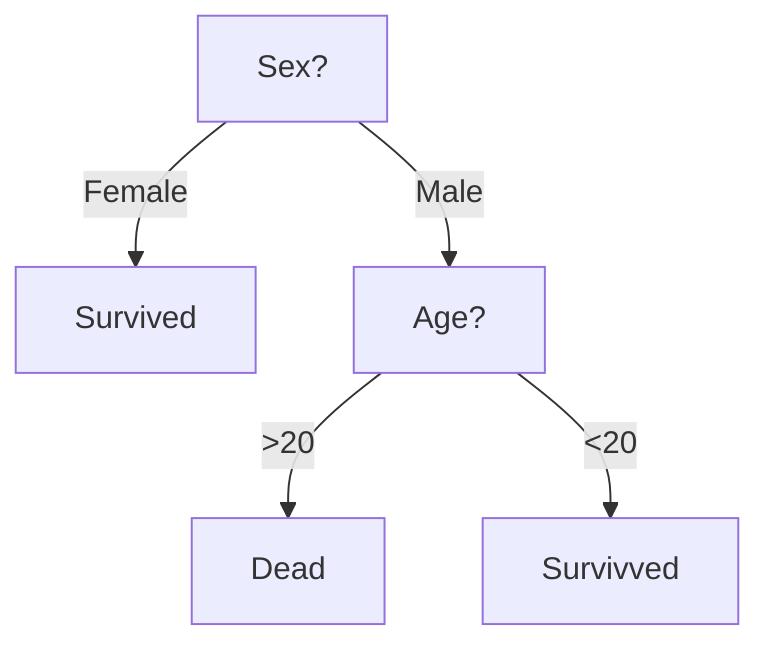
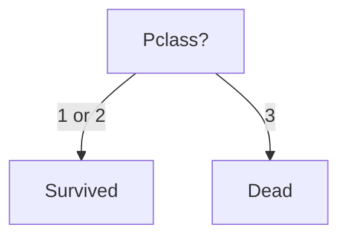

```mermaid
graph TD
    A[Sex?] -- Female --> B[Survived];
    A -- Male --> C[Age?]
    C -- >20 --> D[Dead]
    C -- <20 --> E[Survivved]
```

```mermaid
    graph TD
    A[Pclass?] -- 1 or 2 --> B[Survived];
    A -- 3 --> C[Dead]
```